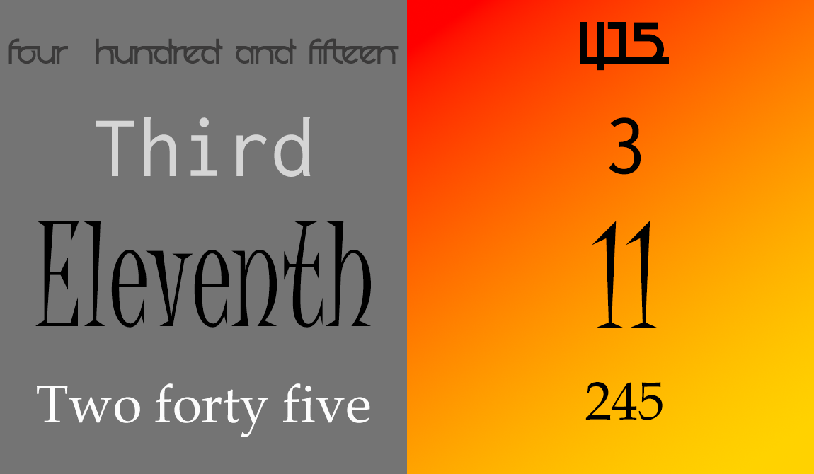

# Tools for AI agent: Words to numbers
<p align= 'center'>
  
</p>

## Introduction and use case
This repo has been created with a very specific use case. Solving the issue of converting words to numbers while using speech-to-text.

I am currently working on a tool that has its own text based naviational interface (similar to search for news, videos, etc.). An iterim output of this interface is to provide a list of options that the user can choose from to get into more detail of that option. 
This is extremely easy when we are using the keyboard i.e. we can just type in the number of the option we want. 

However, when we use voice to provide this option, the model can process the speech in multiple formats. If we say "**two thousand and twenty four**", it may process it as any of the following:
1. Two thousand and twenty four
2. Two thousand & twenty four
3. 2024

We may also pronounce it in other ways i.e.
1. Two thousand twenty four (without the 'and')
2. two thousand and twenty fourTH (to refer to the 2024th item)

**However, what we want is for the return value to be only  "2024"**. This library seeks to do that.

## Sample inputs / outputs
```
Input: 'four hundred and fifteenth' => Output: 415
Input: 'two forty five' => Output: 245
Input: 'thirteenth' => Output: 13
Input: 'thirteen' => Output: 13
Input: 'two hundred and forty seven' => Output: 247
Input: 'three thousand two hundred forty first' => Output: 3241
```

## Usage
```
from src.words2numbers import words_to_numbers
w2n = words_to_numbers("four hundred and fifteenth")
if w2n:
print(f'Numeric version: {w2n})
```
